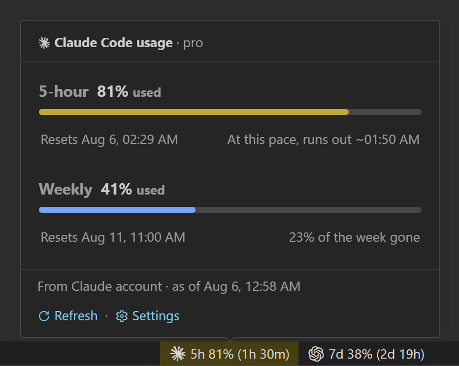

# Agent Usage Bar

See Claude Code and Codex usage, reset times, and pace directly in the VS Code status bar.

Usage is read at the account level, not inferred from local activity, so activity from other machines, terminals, and editors is included.

No configuration is required. Both providers are enabled by default and refresh automatically.

   

## What it shows

One status bar item per provider, each with its own monochrome glyph:

| Example | Meaning |
| --- | --- |
| `5h 42% (2h 15m)` | 42% of the 5-hour window used, which refills in 2h 15m. |
| `5h 42% (2h 15m) · 7d 18% (4d 6h)` | Both windows, in `full` display mode. |
| `5h 58% left (2h 15m)` | The same reading with `percentageMode` set to `remaining`. |
| `~5h 0%` | The window reset since this reading; `0%` is assumed, not read, and no color is raised on it. |
| `$(history) 5h 42% (2h 15m)` | The reading is more than ten minutes old. |
| `--` | No reading yet. The tooltip says why. |

By default, the item turns yellow when usage reaches the warning threshold and red at the error threshold. Set `agentUsageBar.warnWhen` to `overPace` to show yellow only when the warning threshold is reached ahead of schedule—for example, 80% used before 80% of the window has passed. The red threshold always applies. Colors use the percentage **used**, regardless of the selected display mode. The item also turns red when a provider reports that the account is stopped by a spend limit or hard rate limit, even when the percentage is low; the tooltip states the reason.

Hover to see the plan name, a themed progress bar for each window, exact reset times, pace, any credit balance and when the soonest reset credit expires, and the last refresh error. The bars use the same warning and error thresholds as the status item. The tooltip also links to refresh and settings. Click either status item to toggle that provider, refresh usage, or open settings.

## Pace

Beside each window's reset time, the tooltip says where that window is heading:

| Line                            | Meaning                                             |
| ------------------------------- | --------------------------------------------------- |
| `At this pace, runs out ~12:20` | The 5-hour window hits the limit before it refills. |
| `At this pace, ~34% by reset`   | It does not, and this is where it ends up instead.  |
| `68% of the week gone`          | How much of the weekly window has elapsed.          |

Only the 5-hour window is forecast. It opens on your first message, so its elapsed time roughly follows working time. The weekly window starts from a calendar anchor and continues through nights and days off. Forecasting from a busy Monday could therefore predict a limit by Thursday even when the rest of the week is quiet. For that window, the tooltip shows elapsed time instead of a forecast.

Pace remains hidden until the window has been open for fifteen minutes, and the 5-hour forecast also requires at least three percent usage. These minimums prevent rounded early values from being presented as a meaningful rate. Set `agentUsageBar.showPace` to `false` to hide pace information.

`warnWhen` works even when `showPace` is off. If a window is too new to compare, the warning threshold applies normally.

## One reading for every window

Every VS Code window runs its own copy of an extension. Without coordination, six open windows could make the same request six times and briefly show different readings.

The windows in one VS Code profile instead share the latest reading and the network refresh schedule:

- **Six windows cost about what one does.** Only one window actually asks; the rest read the answer.
- **All of them show the same number**, including the ones that never made a request.
- **No window has an independent network refresh schedule.** Each window still updates its own countdown display, but the next account read is due at one shared time. If the reading window closes, another window can retry after the shared minimum delay instead of waiting for a full refresh interval.
- **A rate limit is honoured everywhere at once**, and every item counts the same wait down.

VS Code shares the extension state between windows in the same profile. That state contains the latest result and the time its read began. A window that finds a recent shared result displays it instead of requesting another one. When the configured interval expires, whichever window notices first can attempt the next read.

There is no elected leader. The window that completed the previous read gets a short head start, which usually keeps subsequent reads in the same window. When several windows become due together, they write a shared claim, wait briefly for it to propagate, and check it again before making a request. This is coordination through VS Code state, not an atomic lock. A rare tie can produce one duplicate request, but cannot replace a newer published reading with an older one.

## Requirements

- VS Code 1.100.0 or newer, desktop.
- For the Claude item: [Claude Code](https://claude.com/claude-code) installed and signed in, either as the standalone CLI or as the official Claude Code extension, which ships its own copy of it. Signing in to the Claude desktop app is not enough on its own; it keeps its sign-in somewhere else entirely.
- For the Codex item: [Codex](https://chatgpt.com/download/) installed and signed in, either through the desktop app or as the standalone [CLI](https://github.com/openai/codex). The extension finds whichever you have, including the copy the Codex IDE extension ships.

Neither is required for the other. A provider that is not installed or not signed in says so in its tooltip; switch it off in the settings and its item disappears.

## Install

Search for **Agent Usage Bar** in the Extensions view, or install it from the [VS Code Marketplace](https://marketplace.visualstudio.com/items?itemName=ragentis.agent-usage-bar) or [Open VSX](https://open-vsx.org/extension/ragentis/agent-usage-bar).

To install a `.vsix` by hand instead:

1. Download or build one (see [CONTRIBUTING.md](CONTRIBUTING.md)).
2. Run **Extensions: Install from VSIX...** in VS Code and pick the file.

## Settings

Run **Agent Usage Bar: Open settings**, or click either status bar item and pick **Open settings**.

| Setting | Default | Purpose |
| --- | --- | --- |
| `agentUsageBar.displayMode` | `compact` | `compact` shows the shortest active window; `full` shows both. |
| `agentUsageBar.percentageMode` | `used` | Show the percentage `used` or the percentage `remaining`. |
| `agentUsageBar.showPace` | `true` | Show where each window is heading. |
| `agentUsageBar.warningThreshold` | `80` | Warning color threshold based on used percentage. |
| `agentUsageBar.errorThreshold` | `95` | Error color threshold; never falls below warning. |
| `agentUsageBar.warnWhen` | `threshold` | `overPace` warns only when usage reaches the threshold ahead of schedule. |
| `agentUsageBar.claude.enabled` | `true` | Show Claude Code usage. |
| `agentUsageBar.codex.enabled` | `true` | Show Codex usage. |
| `agentUsageBar.claude.label` | `""` | Text to show instead of the Claude mark. |
| `agentUsageBar.codex.label` | `""` | Text to show instead of the Codex mark. |
| `agentUsageBar.locale` | `""` | Language tag for dates and times; empty follows VS Code. |
| `agentUsageBar.refreshIntervalSeconds` | `300` | Background refresh interval, clamped to 30–3600. |

In `compact` mode, the item normally shows the shortest window. If a longer window triggers a warning or error color, it is shown instead so the highlighted state has a visible cause. A warning suppressed by `overPace` does not make the item switch windows.

When the locale setting is empty, dates and times follow VS Code's display language rather than the operating system's regional settings. For example, VS Code in English uses US-style dates even when the operating system uses another region. Set a language tag such as `en-GB`, `de-DE`, or `sr-Latn-RS` to choose the format explicitly. Add `-u-hc-h23` for a 24-hour clock or `-u-hc-h12` for a 12-hour clock, as in `en-US-u-hc-h23`. An unsupported tag is ignored.

Each provider has its own monochrome mark. Set a label to replace it with a plain string or a codicon reference such as `$(sparkle)`. The value is collapsed to one line and limited to 24 characters so a hand-edited setting cannot stretch the status bar.

## Troubleshooting

After a refresh failure, the last good reading remains visible instead of being replaced with an empty value. The tooltip states what happened and, when an action can help, shows it on a separate line under a lightbulb.

| The tooltip says | What it means |
| --- | --- |
| No Claude Code sign-in was found | Sign in to the Claude Code CLI or extension; the Claude desktop app keeps a store of its own. |
| The Claude Code sign-in has expired | Run Claude Code; it renews its own token. This extension deliberately will not. |
| Claude Code is no longer signed in | The service rejected the stored token. Sign in to Claude Code again. |
| Rate limited, retrying at … | No action is required. Reading resumes at the displayed time. |
| The usage service could not be reached | Check the network or proxy. The last reading remains visible with its age. |
| Codex reported no usage windows | Sign in to Codex, or the account has no windows to report. |
| The Codex CLI could not be started | Codex was not found in a supported local installation; see [Platform scope](#platform-scope). |
| The Codex app server timed out | The CLI stopped responding. The next read starts a fresh one automatically. |

**Rate limited.** A `Retry-After` response pauses background polling, refreshes triggered by local agent activity, and menu refreshes alike. The tooltip shows when reading will resume. A response without a delay pauses reads for one minute. A delay longer than one hour is capped at one hour so an excessive or invalid value cannot leave the extension stalled beyond its longest refresh interval.

**A macOS keychain prompt was declined.** The extension waits half an hour before trying again, preventing a new prompt on every five-minute refresh. Run **Agent Usage Bar: Refresh usage** to retry immediately.

**The numbers look old.** A history icon and tooltip note appear when a reading is more than ten minutes old. Refresh from the menu to request a new reading without the normal minimum interval.

**Nothing appears in a Remote-SSH, WSL, or dev container window.** The extension runs beside the local VS Code user interface and reads local agent sign-ins. See [Platform scope](#platform-scope).

## Data access

Account usage cannot be calculated reliably from activity on one machine, so the extension asks each provider for the account-level reading. The credential boundary for those requests is described below.

### Codex

The extension starts `codex app-server` and requests usage over JSON-RPC through stdin and stdout. Codex manages and refreshes its own credentials, so this extension never reads or handles a Codex token. `~/.codex/auth.json` remains outside the boundary, and `npm run audit:bundle` fails if that path appears in the shipped bundle. If the CLI cannot be found or is signed out, the status item reports that state instead of inferring usage from local files.

An app server keeps the credentials it loaded when it started, so a sign-in or token refresh performed elsewhere reaches only one started after it. The extension therefore watches the `~/.codex` directory for the fact that `auth.json` was replaced and starts a fresh app server at the next read. The name is matched against a directory event; the file itself is never opened. The directory is watched rather than the file because Codex replaces `auth.json` by rename, which a watch on the file would stop following.

### Claude Code

**The extension reads the token stored by Claude Code, uses it for one request, and discards it.** The request goes to `https://api.anthropic.com/api/oauth/usage`, the same endpoint used by the official Claude Code extension for usage data.

The token is never logged, cached, or written back to shared state, settings, or the extension's secret storage. Caching it would create a second credential store that could become stale when Claude Code rotates the token or signs out. Reading the existing store when needed avoids that additional copy.

The extension also never refreshes the token. Refreshing can rotate the stored credential, and competing with Claude Code for that update could invalidate Claude Code's own session. When the token expires or is rejected, the extension reports it and leaves renewal to Claude Code.

**Where the token lives** depends on the platform:

| Platform       | Location                                                      |
| -------------- | ------------------------------------------------------------- |
| Windows, Linux | `~/.claude/.credentials.json`                                 |
| macOS          | The login keychain, under the item Claude Code created for it |

The store belongs to Claude Code and is shared by the CLI and the official Claude Code extension, which includes its own copy of the CLI. Signing in through either one therefore creates the same credential. The Claude desktop app uses a separate encrypted store that this extension does not read.

#### Reading the macOS keychain

The extension reads the keychain with `/usr/bin/security find-generic-password`, using the absolute system path and a separate argument list. Nothing on `PATH` can replace that executable, and no argument is interpreted as a command. The operation is read-only; `npm run audit:bundle` fails if the bundle carries any password verb other than `find-generic-password`.

The credentials file is checked first on every platform because Claude Code uses it when the keychain is unavailable. A normal macOS keychain read therefore starts one short-lived process; normal reads on other platforms start none.

Normally, reading the item through `security` requires no authorization prompt because Claude Code's access list already permits it. A locked keychain, an item transferred from another Mac, or a manually restricted access list can still cause a prompt. The extension respects that result:

| Outcome | What happens next |
| --- | --- |
| No such item | Checked again on the next interval without showing a prompt. |
| Declined, locked, or not ours | Not asked again for half an hour, so a declined prompt does not come back five minutes later. |
| No answer within five seconds | Abandoned, and counted as a refusal. |

The extension distinguishes these outcomes through the exit code returned by `security`. Multi-window coordination ensures that only the window performing the account read can trigger the keychain request.

### Agent transcripts

The extension watches `~/.codex/sessions` and `~/.claude/projects` only for the fact that a `.jsonl` file changed. After the writes settle, that change requests a usage refresh. Transcript contents are never opened.

Codex also sends an `account/rateLimits/updated` notification while its app server is running. The extension stops an idle app server after ten minutes instead of keeping a child process alive only for that notification. It also drops one whose read failed, because a failing app server tends to keep failing. File watching covers later activity and triggers a fresh app server when another reading is needed.

Every automatic read has a minimum interval of thirty seconds per provider, regardless of which trigger requested it. A long agent turn can write its transcript in several bursts, and those small updates do not justify a request each. A manual menu refresh bypasses this minimum.

### What is stored, and what never leaves

The Anthropic usage endpoint is the extension's only direct network target. The extension opens files only for parsing and performs no direct filesystem writes.

`npm run audit:bundle` checks the shipped code on every build. For the member-access forms produced by the current build, it rejects `node:fs` members outside the explicit read-only set. It permits only `spawn` from `node:child_process` and rejects literal `shell: true` options.

The shipped text leaves two things for code review to establish. The URL allowlist can inspect only addresses written out in full; a URL assembled from parts at runtime is outside its reach. Likewise, because the program passed to `spawn` is resolved at runtime, the audit constrains how a process is started but cannot prove which one. The audit catches accidental violations of these promises; code review remains responsible for runtime-computed behavior.

It persists exactly two things, both through VS Code's own APIs:

- Your settings, when you toggle a provider from the menu.
- The last usage reading, so the other windows can show it — percentages, reset times, window lengths, and the plan name.

Neither stored value contains a token, prompt, or file content. The extension has no telemetry, runtime dependency, custom credential path, or custom update mechanism. No prompt, source code, or file content is sent anywhere.

## Platform scope

Desktop VS Code on Windows, macOS, and Linux, hand-tested on all three against real installs of both agents. The per-platform paths are covered by tests on all three CI runners as well: the Codex install layouts, the macOS keychain read, and the file watcher against the real `recursive` implementation.

The extension runs on the same machine as the VS Code user interface, where both agents keep their sign-ins. In a Remote-SSH, WSL, or dev container window, it therefore reports usage for the local account. It does not read an agent sign-in that exists only on the remote side.

There is no web build. It reads local files and starts a local process, neither of which exists in a browser.

## Contributing

Setup, the architecture, the scripts, and how the provider glyphs are built are all in [CONTRIBUTING.md](CONTRIBUTING.md). Security reports go through [SECURITY.md](SECURITY.md).

## License and trademarks

MIT; see [LICENSE](LICENSE).

The icon font in `assets/agent-usage-bar.woff` was created specifically for this project and does not include third-party font files.

Claude and Anthropic are trademarks of Anthropic. Codex and OpenAI are trademarks of OpenAI. The monochrome provider glyphs are used solely to identify the services whose usage is being displayed.

This project is independent and is not affiliated with, endorsed by, or sponsored by Anthropic or OpenAI. Either glyph can be replaced with your own text or a codicon; see [Settings](#settings).
